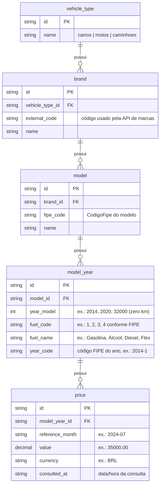

## Organização de entidades da Tabela FIPE (proposta)

Este documento descreve uma modelagem de dados normalizada que representa como a Tabela FIPE costuma ser consultada e organizada por entidades. É uma proposta baseada no comportamento público das APIs da FIPE (marcas → modelos → anos → valor por mês de referência) e em domínios comuns de veículos.

### Visão geral das entidades
- **Tipo de Veículo (`vehicle_type`)**: categoria principal (carros, motos, caminhões).
- **Marca (`brand`)**: montadora/fabricante dentro de um tipo de veículo.
- **Modelo (`model`)**: modelo comercial da marca; é onde normalmente vive o `CodigoFipe`.
- **Ano do Modelo (`model_year`)**: combinação de ano-modelo e combustível (o código de ano da FIPE agrega ambos, ex.: `2014-1`).
- **Preço/Valor (`price`)**: valor da FIPE por mês de referência para um `model_year`.

### Diagrama ER (Mermaid)

### Campos e regras sugeridas
- **vehicle_type**
  - `id` (PK), `name` único em ["carros", "motos", "caminhoes"].
- **brand**
  - `id` (PK), `vehicle_type_id` (FK → `vehicle_type.id`), `external_code` (string da API), `name`.
  - Regra: (`vehicle_type_id`, `external_code`) deve ser único.
- **model**
  - `id` (PK), `brand_id` (FK), `fipe_code` (Código FIPE do modelo), `name`.
  - Regra: `fipe_code` único globalmente; (`brand_id`, `name`) único para consistência.
- **model_year**
  - `id` (PK), `model_id` (FK), `year_model` (int), `fuel_code` (string/enum), `fuel_name`, `year_code` (ex.: "2019-1").
  - Regra: (`model_id`, `year_code`) único.
- **price**
  - `id` (PK), `model_year_id` (FK), `reference_month` (YYYY-MM), `value` (decimal(12,2)), `currency` ("BRL"), `consulted_at` (timestamp).
  - Regra: (`model_year_id`, `reference_month`) único para versionamento mensal.

### Mapeamento típico com a API pública
- Listar marcas por tipo: mapeia `vehicle_type` → `brand` (usa `external_code`).
- Listar modelos por marca: `brand.external_code` → retorna modelos com `codigo` e `nome`; persistir em `model` e preencher `fipe_code` quando disponível.
- Listar anos por modelo: retorna códigos como `YYYY-C` (ano + combustível); persistir em `model_year` com `year_code`, `year_model`, `fuel_code`, `fuel_name`.
- Buscar valor: retorna `CodigoFipe`, `MesReferencia`, `Valor`, `Combustivel`, `SiglaCombustivel`; persistir em `price` e manter coerência com `model.fipe_code`.

### Consultas comuns
- Preço atual do modelo-ano mais recente:
  - Selecionar em `price` o maior `reference_month` para um `model_year` específico.
- Histórico de preços por mês:
  - Selecionar `price` por `model_year_id` ordenando por `reference_month`.
- Navegação hierárquica:
  - `vehicle_type` → `brand` → `model` → `model_year` → `price`.

### Observações
- O `CodigoFipe` é estável por modelo, e o código de ano FIPE agrega ano e combustível.
- `year_model = 32000` costuma indicar zero km (código especial da FIPE).
- A FIPE não diferencia por UF/município; os valores são nacionais por mês de referência.
